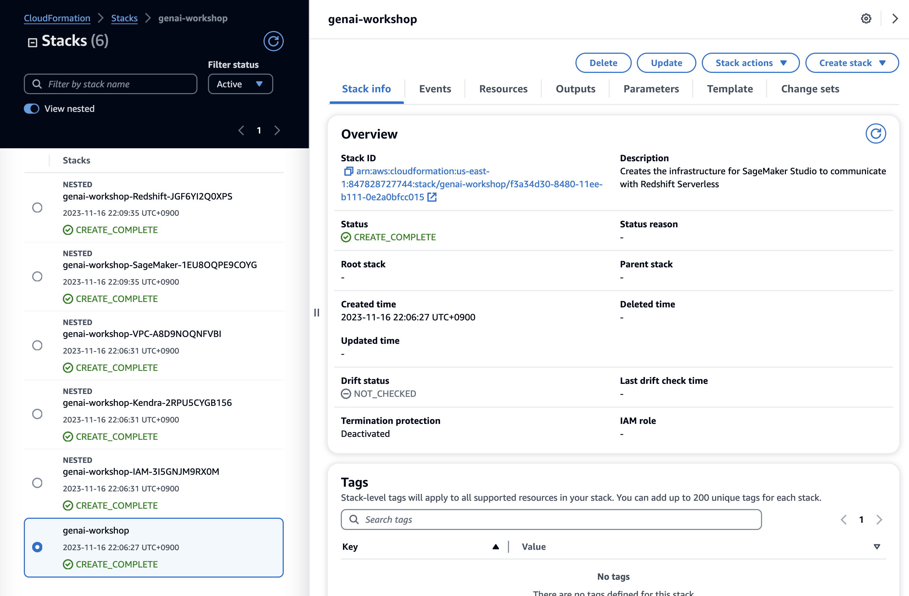
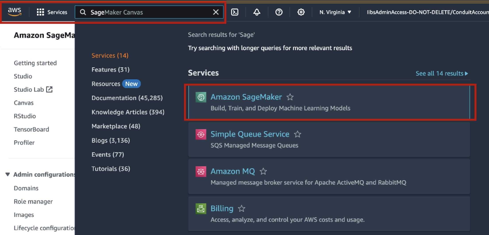
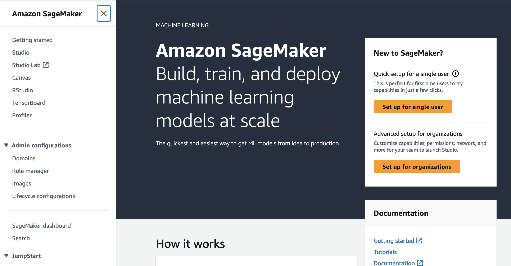
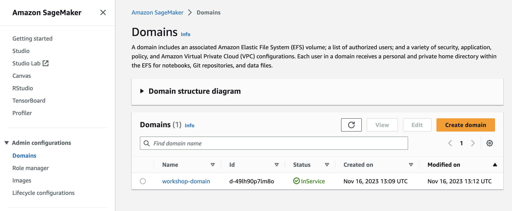
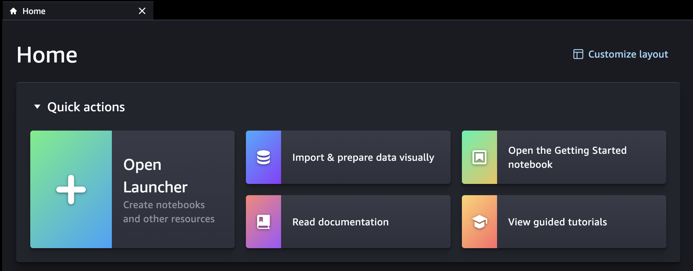
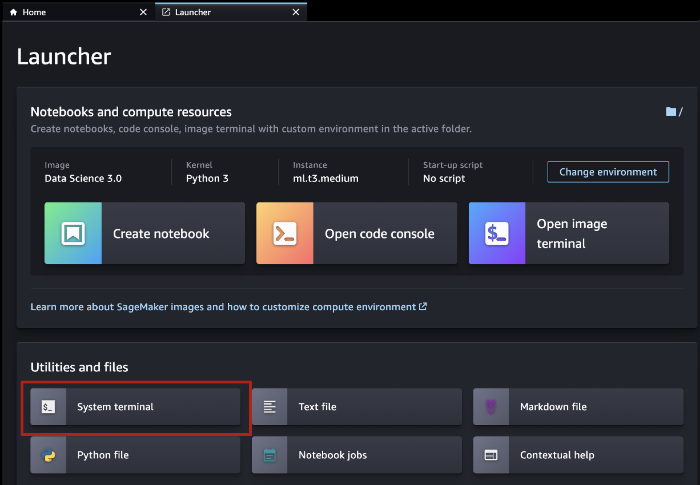
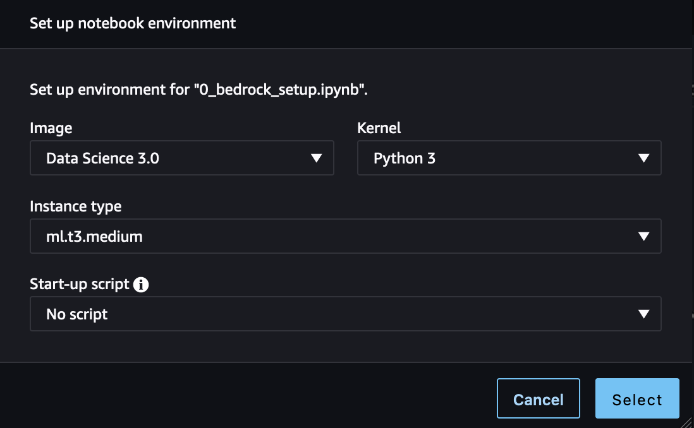

# GenAI Workshop for Retail

## SageMaker Studio 실행



위와 같이 Cloudformation으로 모든 스택이 정상적으로 설치가 되었다면 SageMaker Studio를 실행합니다.

AWS 콘솔에서 SageMaker로 이동합니다.


좌측 메뉴에서 Domains를 선택합니다.


이미 생성된 workshop-domain을 선택합니다.


User Profiles에서 Launch를 클릭하고 Studio를 선택합니다.


아래와 같이 SageMaker Studio가 실행됩니다.


SageMaker Studio Home에서 Open Launcher를 선택합니다.


Launcher에서 System Terminal을 실행합니다.


Terminal에서 아래 명령어를 실행해서 실습할 자료들을 다운로드 받습니다.
git clone https://github.com/jesamkim/aws-genai-for-retail.git


Note: 모든 노트북은 아래와 같이 Data Science 3.0, Python 3, ml.t5.medium에서 가장 잘 실행됩니다.


### 이제 모든 실습환경이 만들어졌습니다. 

# Option Amazon Bedrock 안내 

아래에서는 Amazon Bedrock 서비스에 연결하는 기본 사항을 안내합니다.

Amazon Bedrock은 타사 제공업체 및 Amazon의 FM에 대한 액세스를 제공하는 완전 관리형 서비스로, API를 통해 이용할 수 있습니다. 베드락을 사용하면 다양한 모델 중에서 사용 사례에 가장 적합한 모델을 찾을 수 있습니다.

## Getting started

### 노트북 환경 선택

이 워크샵은 SageMaker Studio 환경에서 실행할 수 있는 **Python notebooks** 로 제공됩니다:

- 풍부한 AI/ML 기능을 갖춘 완전 관리형 환경의 경우, [SageMaker Studio](https://aws.amazon.com/sagemaker/studio/)를 사용하는 것을 권장합니다. 빠르게 시작하려면 [도메인 빠른 설정 지침](https://docs.aws.amazon.com/sagemaker/latest/dg/onboard-quick-start.html)을 참조하세요.
- 완전 관리형이지만 좀 더 기본적인 환경을 원하시면 [SageMaker Notebook 인스턴스](https://docs.aws.amazon.com/sagemaker/latest/dg/howitworks-create-ws.html)를 사용하실 수 있습니다.
- 기존(로컬 또는 기타) 노트북 환경을 사용하시려면 [AWS 호출을 위한 자격 증명](https://docs.aws.amazon.com/cli/latest/userguide/cli-chap-configure.html)이 있는지 확인하세요.


### Option: Bedrock에 대한 AWS IAM 권한 활성화

> 실습에서 사용될 IAM은 Cloudformation으로 사전에 정의되어있어 아래 내용은 생략 가능합니다.

노트북 환경에서 가정하는 AWS ID(SageMaker의 [*Studio/notebook Execution Role*](https://docs.aws.amazon.com/sagemaker/latest/dg/sagemaker-roles.html)이거나 자체 관리 노트북의 역할 또는 IAM 사용자일 수 있음)는 Amazon Bedrock 서비스를 호출할 수 있는 충분한 [AWS IAM 권한](https://docs.aws.amazon.com/IAM/latest/UserGuide/access_policies.html)을 가지고 있어야 합니다.

Bedrock 접근 권한을 부여하려면 다음과 같이 하세요:

- [AWS IAM Console](https://us-east-1.console.aws.amazon.com/iam/home?#)을 엽니다.
- [Role](https://us-east-1.console.aws.amazon.com/iamv2/home?#/roles) (SageMaker를 이미 사용 중이거나 IAM 역할을 맡고 있는 경우), 또는 [User](https://us-east-1.console.aws.amazon.com/iamv2/home?#/users)를 찾습니다.
- Add Permissions > Create Inline Policy*를 선택하여 새 인라인 권한을 첨부하고, *JSON* 편집기를 열어 아래 예제 정책에 붙여넣습니다:

```
{
    "Version": "2012-10-17",
    "Statement": [
        {
            "Sid": "BedrockFullAccess",
            "Effect": "Allow",
            "Action": ["bedrock:*"],
            "Resource": "*"
        }
    ]
}
```

> ⚠️ **참조:** Amazon SageMaker를 사용하면 노트북 실행 역할은 일반적으로 AWS 콘솔에 로그인하는 사용자 또는 역할과 *별개*로 설정됩니다. Amazon Bedrock용 AWS 콘솔을 탐색하려면 콘솔 사용자/역할에도 권한을 부여해야 합니다.

Bedrock의 세분화된 작업 및 리소스 권한에 대한 자세한 내용은 베드락 개발자 가이드를 확인하세요.


이제 실습용 노트북을 탐색할 준비가 되었습니다! [bedrock_boto3_setup.ipynb](bedrock_boto3_setup.ipynb)를 참조하여 Bedrock SDK를 설치하고, 클라이언트를 생성하고, Python에서 API 호출을 시작하는 방법에 대해 자세히 알아보세요.