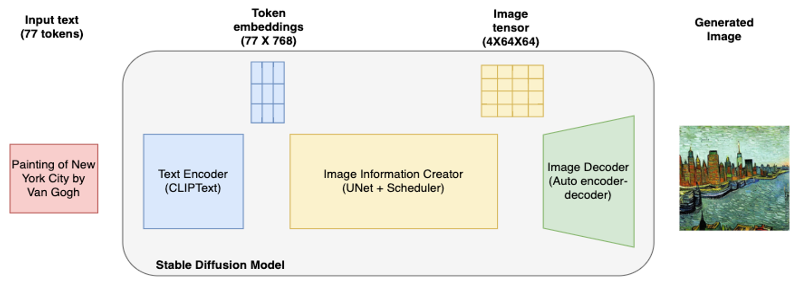
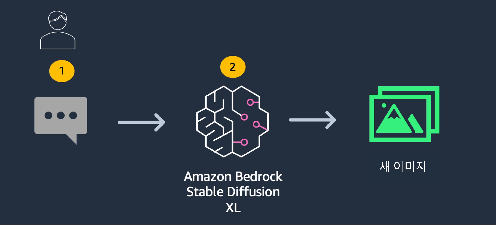
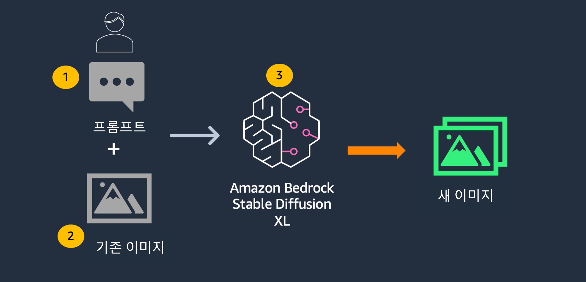

# Bedrock - Stable Diffusion XL을 이용한 "제품 디자인과 광고를 위한 이미지 생성"
## 실습 소개

### 개요

이미지로 자신의 생각을 표현하는 아티스트, 디자이너, 콘텐츠 크리에이터에게 이미지 생성은 지루한 작업일 수 있습니다. 파운데이션 모델(FM)을 사용하면 이 지루한 작업을 아티스트의 생각을 표현하는 한 줄의 텍스트로 간소화할 수 있으며, FM은 언어 프롬프트에서 다양한 주제, 환경 및 장면의 사실적이고 예술적인 이미지를 만드는 데 사용할 수 있습니다.

이 실습에서는 Amazon Bedrock에서 제공되는 파운데이션 모델을 사용하여 이미지를 생성하고 기존 이미지를 수정하는 방법을 살펴봅니다.

### 이미지 프롬프팅

좋은 프롬프트를 작성하는 것은 때때로 예술이 될 수 있습니다. 특정 프롬프트가 주어진 모델에서 만족스러운 이미지를 생성할지 예측하기 어려운 경우가 많습니다. 하지만 효과가 있는 특정 템플릿이 있습니다. 프롬프트는 크게 (i) 이미지 유형(사진/스케치/그림 등), (ii) 설명(주제/사물/환경/장면 등), (iii) 이미지 스타일(사실적/예술적/예술 유형 등)의 세 부분으로 나눌 수 있습니다. 세 가지 부분을 각각 개별적으로 변경하여 이미지의 변형을 생성할 수 있습니다. 형용사는 이미지 생성 과정에서 중요한 역할을 하는 것으로 알려져 있습니다. 또한 세부 사항을 추가하면 생성 과정에 도움이 되며, 사실적인 이미지를 생성하려면 "a photo of", "a photograph of", "realistic" 또는 "hyper realistic"과 같은 문구를 사용할 수 있습니다.  

아티스트별 이미지를 생성하려면 "by Pablo Picasso", "oil painting by Rembrandt", "landscape art by Frederic Edwin Church", "pencil drawing by Albrecht Dürer"과 같은 문구를 사용할 수 있습니다. 여러 아티스트를 결합할 수도 있습니다. 카테고리별로 예술적 이미지를 생성하려면 "lion on a beach, abstract"과 같이 프롬프트에 예술 카테고리를 추가하면 됩니다. 다른 카테고리로는 "oil painting", "pencil drawing", "pop art", "digital art", "anime", "cartoon", "futurism", "watercolor", "manga" 등이 있습니다. 조명이나 카메라 렌즈(예: 35mm wide lens or 85mm wide lens), 구도(portrait/landscape/close up 등)에 대한 세부 정보도 포함할 수 있습니다.

동일한 프롬프트가 여러 번 주어지더라도 모델은 다른 이미지를 생성합니다. 따라서 여러 이미지를 생성하고 애플리케이션에 가장 적합한 이미지를 선택할 수 있습니다.

## Foundation Model

Amazon Bedrock은 Stability AI의 이미지 생성을 위한 독자적인 기반 모델인 [Stable Diffusion XL](https://stability.ai/stablediffusion)을 지원합니다. Stable Diffusion은 확산의 원리에 따라 작동하며, 각각 다른 목적을 가진 여러 모델로 구성됩니다:

1. CLIP text encoder
2. VAE decoder
3. UNet
4. VAE_post_quant_conv

이 아키텍처를 통해 작동 원리를 확인할 수 있습니다:

## 대상 고객

마케팅 회사, 에이전시, 웹 디자이너 및 일반 기업은 이 기능을 활용하여 처음부터 완전히 새로운 이미지를 생성할 수 있습니다.

## 패턴

이 워크샵에서는 텍스트 또는 이미지 입력부터 시작하여 Amazon Bedrock을 사용한 이미지 생성에 대해 배울 수 있습니다:

1. [Text to Image](./Bedrock%20Stable%20Diffusion%20XL.ipynb)
    
2. [Image to Image (In-painting)](./Bedrock%20Stable%20Diffusion%20XL.ipynb)
    

## Setup
이 섹션의 실습을 실행하기 전에 [Bedrock boto3 setup 노트북](../0_setup/1_bedrock_boto3_setup.ipynb)을 실행했는지 확인합니다.

## Helper
이미지 생성을 용이하게 하기 위해 `/utils/bedrock.py`에 유틸리티 클래스 `Bedrock`이 구현되어 있습니다. 이를 통해 이미지를 쉽게 생성할 수 있습니다.

[여기](https://platform.stability.ai/docs/features/animation/parameters#available-styles)에서 다양한 `style_preset` 옵션을 살펴볼 수도 있습니다.
