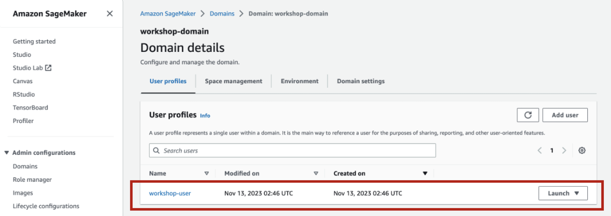

# 실습 환경 자원 삭제

본 실습 과정에서 사용된 AWS 자원은 크게 2가지 유형으로 생성되었습니다. CloudFormation 을 통하여 자동으로 생성된 자원들과 실습과정에서 사용자에 의해 생성된 자원이 있습니다. 따라서, 실습에 사용된 AWS 자원을 삭제하려면 먼저 사용된 사용자 자원을 삭제하고 난 후 CloudFormation을 삭제하여 모든 자원을 삭제하셔야 합니다.

## 자원 삭제

본 실습에서 사용된 SageMaker Studio User profile과 Amazon EFS, Amazon S3 오브젝트 등 Cloudformation이 아닌 사용자에 의해 생성된 일부 자원은 사용자가 직접 삭제해야합니다.

1. Amazon SageMaker 메뉴 중 Domain을 선택한 후 실습에 사용된 workshop-domain을 클릭합니다. 그리고 실습에 사용했던 workshop-user 사용자 프로파일을 클릭하면 아래와 같은 사용자 상세정보가 조회됩니다.

2. App 2개 항목의 우측에 "Delete App"과 "Action-Delete"를 각각 클릭하여 App을 삭제합니다. 

3. 삭제를 위해 팝업에서 "Yes, delete app"을 클릭합니다. 

4. "delete"를 입력하고 "Delete" 버튼을 클릭합니다.

5. 삭제가 진행됩니다(자원 삭제에 5분정도 소요됩니다)

6. 완전히 삭제가 되면 Deleted가 표기됩니다.

7. SageMaker Studio에서 사용되는 Amazon EFS를 삭제합니다.

8. 검색에 사용된 문서파일을 Amazon S3에서 삭제합니다.

## Cloudformation 삭제

- 실습에 사용된 아래의 Cloudformation을 삭제합니다.

1. Cloudformation에서 Delete 버튼을 클릭합니다.

> Cloudformation 삭제에는 시간이 소요됩니다. 여유를 갖고 기다리신 후에 삭제가 정상적으로 되었는지 확인하시기 바랍니다.
2. Cloudformation이 완전히 삭제되었으면 VPC를 삭제하기 위해 VPC로 이동하고 sagemaker-studio-vpc VPC를 선택하여 삭제합니다.

- VPC를 삭제하기 위한 팝업창에서 "delete"를 입력합니다.

## 이제 실습에 사용된 모든 자원이 삭제되었는지 확인합니다.
> VPC

> Subnet

> Amazon SageMaker Studio / Domain / User Profile

> Amazon Redshift Serverless

> IAM Roles

> Amazon Kendra
