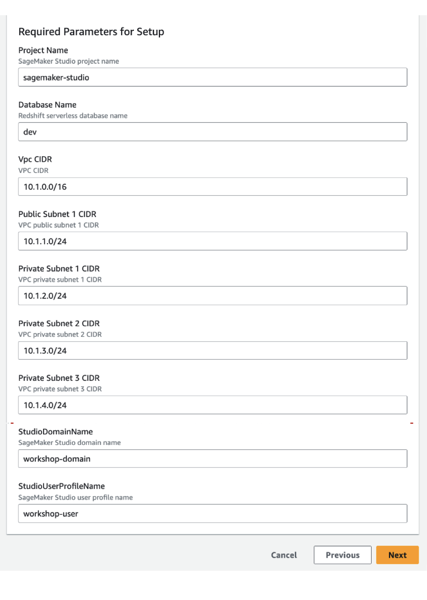

# About AWS GenAI Workshop for Retail

## 실습 환경 구성

본 실습은 Amazon Bedrock을 이용한 4가지 활용 사례 중심으로 구성되었습니다. 실습에는 SageMaker Studio를 사용하며 각 실습에서 사용되는 Amazon Kendra, Amazon Redshift Serverless 등의 인프라 배포를 위해 Cloudformation 템플릿을 제공합니다.

1. 리테일러를 위한 효과적인 제품 설명 및 요약 생성 실습을 통해 LLM의 프롬프트 엔지니어링에 대한 이해를 높입니다.
2. LangChain의 Text-to-SQL을 통해 자연어를 이용한 데이터베이스 검색으로 비즈니스 데이터를 분석할 수 있습니다. 
3. 완전관리형 시멘틱 검색엔진인 Kendra를 사용한 RAG 접근법을 이용하여 매장의 현장 직원들을 위한 Q&A 챗봇을 만들 수 있습니다.
4. Stable Diffusion을 이용해서 제품 디자인과 광고를 위한 이미지 생성하는 방법을 학습힙니다.

- 실습 시작 전 아래의 Cloudformation을 실행합니다.
> 0_setup/workshop-template.yaml

- Cloudformation에서 Create Stack을 클릭합니다.

- 템플릿 소스는 0_setup에 있는 파일을 업로드합니다.

- 아래와 같이 업로드가 준비됩니다.

- Stack Name은 반드시 "genai-workshop"으로 입력합니다. 실습에서는 스택 이름을 사용해서 배포된 리소스 정보를 가져오도록 되어있습니다.

- 동기화 Notification을 받을 이메일주소를 입력합니다.

- 추가 스택 배포를 위해 아래와 같이 클릭하고 Submit을 클릭합니다. 

## 실습에 사용된 자원 삭제

실습이 완료된 이후에는 더 이상 필요하지 않은 자원으로 인한 비용발생을 막기위해 사용된 자원을 반드시 삭제해야합니다.
[자원 삭제](CleanUp.md)
